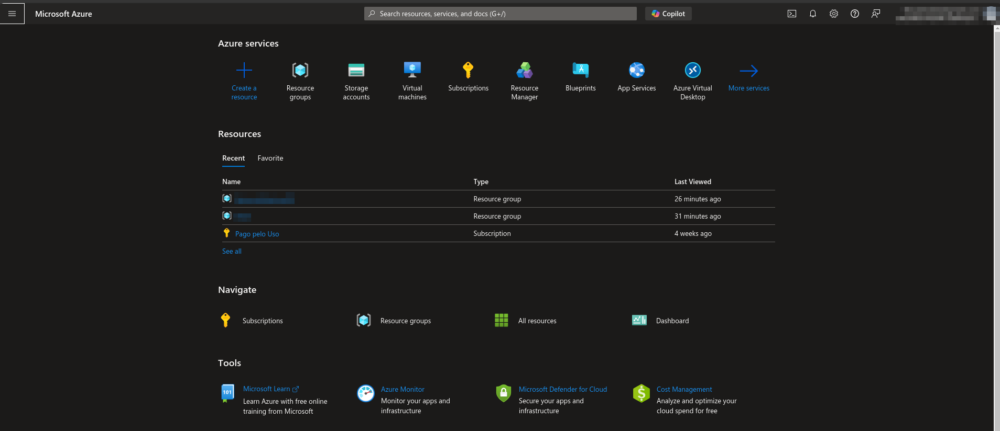
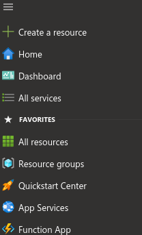

# Gerenciar serviços com o portal do Azure

 

## Introdução

 
O Azure é uma plataforma de nuvem que fornece a computação, o armazenamento e os recursos de rede necessários para criar aplicativos hospedados na nuvem.     

O portal do Azure permite que você crie e gerencie todos os recursos do Azure.

 

## Opções de gerenciamento do Azure

 

As ferramentas normalmente usadas para a interação e para gerenciamento diário incluem:

- **Portal do Azure**: permite interagir por meio de uma interface gráfica do usuário
- **Azure Powershell** e **Azure CLI**: para interações baseadas em automação e linha de comando com o Azure
- **Azure Cloud Shell**: interface de linha de comando baseada na Web
- **Aplicativo móvel do Azure**: para monitorar e gerenciar seus recursos no dispositivo móvel

Também há SDKs do Azure para uma variedade de linguagens e estruturas e APIs REST que ajudam a gerenciar e controlar os recursos do Azure de maneira programática.

 

## Portal do Azure

 

O [portal do Azure](https://portal.azure.com/) é um site público que você pode acessar com qualquer navegador da Web. Depois de entrar com sua conta do Azure, você pode criar, gerenciar e monitorar os serviços e recursos do Azure.   
No portal do Azure, você pode usar a pesquisa para encontrar diferentes tipos de serviços e acessar links para obter ajuda em um tópico.   
O portal do Azure também orienta você em tarefas administrativas complexas usando assistentes e dicas de ferramentas.

 

Em geral, o portal não permite automatizar tarefas repetitivas. Por exemplo, para configurar várias VMs, é necessário criá-las uma de cada vez. Esse processo pode tornar a abordagem do portal menos ideal para tarefas complexas que envolvem repetição. Para esses tipos de tarefas, o Azure PowerShell e a Azure CLI podem ser úteis.

 

## Navegar no portal

 

Com uma conta do Azure, você pode entrar no portal do Azure. O portal é um site de administração baseado na Web que permite interagir com os serviços do Azure e os recursos que você criou. Quase tudo o que você faz com o Azure pode ser feito por meio dessa interface da Web.

 

## Layout do portal do Azure

 

Página inicial do portal do Azure:

Você pode alterar sua exibição padrão para o Dashboard personalizável nas configurações do portal. 

 

## Menu do portal

 

 

## Copilot no Azure

 

Perto do topo da tela, você vê o botão Copilot.

Se a sua organização disponibilizou o Microsoft Copilot no Azure (pré-visualização), pode selecionar este botão para fazer perguntas, navegar rapidamente para serviços e recursos ou obter ajuda com tarefas. Por exemplo, o Copilot no Azure pode ajudá-lo a conceber, operar, otimizar e resolver problemas nas suas aplicações e infraestruturas do Azure. O Copilot para Azure também pode ajudá-lo a obter novos insights sobre quais serviços do Azure podem ajudar com seus objetivos.

 

## Controles globais do portal do Azure

 

O portal do Azure mostra diversos ícones na barra de status no canto superior direito da tela. Esses ícones são controladores globais que estão sempre disponíveis, independentemente do serviço com o qual esteja trabalhando. Cada ícone fornece acesso rápido a funções úteis, como a configuração de definições ou a exibição de notificações sobre a atividade do portal.

 

Vamos examinar cada um desses controles para entendê-los melhor.

 

### Cloud Shell

Selecione o ícone Cloud Shell (>_) para criar uma nova sessão do Azure Cloud Shell. O Azure Cloud Shell é um shell interativo para gerenciar os recursos do Azure.

 

### Notificações

Selecione o ícone de sino para exibir o painel Notificações. 

 

### Configurações

Selecione o ícone de engrenagem para alterar as configurações do portal do Microsoft Azure.   
É possível alterar configurações como:

- Gerenciamento de diretórios e assinatura
- Atraso de saída de inatividade
- Modo de exibição padrão quando você entra pela primeira vez
- Opção do menu do portal como submenu ou encaixado
- Temas de cores e contraste
- Idioma e formato de região

 

### Painel de suporte + solução de problemas

Selecione o ícone de ponto de interrogação para exibir o painel Suporte + solução de problemas. É aqui que você pode obter ajuda se estiver tendo um problema ou precisar de suporte. Você também pode ver se algum evento de integridade em andamento está afetando sua assinatura do Azure ou encontrar links para recursos de suporte.

 

### Painel de comentários

Selecione o ícone Comentários para abrir um painel que permite que você envie comentários sobre o Azure para a Microsoft. Você pode decidir se deseja ou não permitir que a Microsoft responda aos seus comentários por email.

 

## Configurações de perfil

 

Se selecionar seu nome no canto superior direito, você abrirá um menu com algumas opções:

- Entrar com outra conta ou sair completamente
- Exibir seu perfil de conta, no qual é possível alterar sua senha

 

Selecione o botão "..." no lado direito para obter opções para:

- Verificar suas permissões
- Exibir a fatura
- Enviar uma ideia
- Atualizar suas informações de contato

 

## Azure Marketplace

O Azure Marketplace geralmente é o local em que você começa ao criar novos recursos no Azure. O Marketplace permite que você encontre, experimente, compre e provisione aplicativos e serviços de centenas de provedores de serviços líderes, todos certificados para execução no Azure.

O catálogo de soluções abrange milhares de ofertas em várias categorias do setor, como plataformas de contêineres de código aberto, imagens de máquinas virtuais, bancos de dados, ferramentas de desenvolvedor e blockchain. Utilizando o Azure Marketplace, você pode implantar soluções de ponta a ponta hospedadas em seu próprio ambiente do Azure.

 

## Assistente do Azure

O Assistente do Azure é um serviço gratuito, criado no Azure e que fornece recomendações sobre alta disponibilidade, segurança, desempenho, excelência operacional e custo. O Assistente do Azure analisa seus serviços implantados e sugere maneiras de melhorar seu ambiente nessas áreas. Você pode ver as recomendações no portal ou baixá-las no formato PDF ou CSV.

Você pode acessar o Assistente do Azure, selecionando Assistente no menu de navegação ou pesquisar por ele no menu Todos os Serviços.