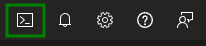
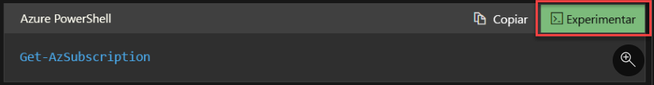
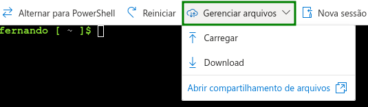
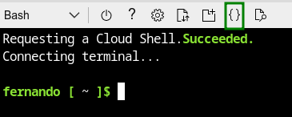

# Azure Cloud Shell

 

## Introdução

 

O Azure Cloud Shell é uma experiência de linha de comando acessível por navegador para gerenciar recursos do Azure.
Ele proporciona a você a flexibilidade de escolher a experiência de shell mais adequada para o modo como você trabalha, Bash ou PowerShell.
Com o Cloud Shell, você tem um shell autenticado e interativo que não faz parte de um computador local.

Você é administrador de TI, responsável pela infraestrutura de nuvem na qual a empresa hospeda os aplicativos. Esses aplicativos usam recursos de nuvem diferentes, como VMs do Azure, armazenamento de blobs do Azure, rede do Azure e outros. Em muitas ocasiões, você é solicitado a executar operações nesses recursos de nuvem em momentos em que não está usando seu laptop de trabalho. Em alguns casos, você está com o laptop de um amigo, um smartphone ou outro computador pessoal.

 

## O que é o Azure Cloud Shell

 

O Azure Cloud Shell é um ambiente de linha de comando que você pode acessar por meio de um navegador Web.  
Por ser gerenciado pela Microsoft, você sempre terá acesso as versões mais recentes da CLI do Azure e dos módulos do PowerShell diretamente de qualquer navegador.   
Usando um navegador é possível abrir o Cloud Shell e entrar para ter acesso ao um ambiente de linha de comando totalmente conectado às permissões da sua conta e aos recursos aos quais você tem acesso.   
Tudo isso funciona em uma infraestrutura compatível com a criptografia dupla em repouso por padrão.
O Azure Cloud Shell também fornece armazenamento em nuvem para persistir arquivos como chaves SSH, scripts, etc. Essa funcionalidade permite acessar arquivos importantes entre sessões e com computadores diferentes.   
Você pode usar o editor do Cloud Shell para fazer alterações em arquivos, como scripts, que são salvos nesse armazenamento em nuvem diretamente da interface do Cloud Shell.

 

## Como funciona o Azure Cloud Shell

 

Como administrador de TI, você está frequentemente de plantão para executar tarefas administrativas.  
Como você está visitando sua família, você não tem acesso à sua estação de trabalho administrativa e aos scripts de diagnóstico. Você tem acesso a um laptop com um navegador da Internet. Usando o laptop, você deve navegar até o portal do Azure, autenticar-se na assinatura do Azure da sua organização, abrir o Azure Cloud Shell, montar um compartilhamento de arquivos do Azure, acessar seus scripts de diagnóstico e diagnosticar e corrigir os problemas com a VM, fazendo com que ela volte a operar.

 

## Acessar o Cloud Shell

 

Opções de acesso ao Azure Cloud Shell:

- Usando um link direto:  [https://shell.azure.com]( https://shell.azure.com)

- No Portal do Azure:  [https://portal.azure.com/](https://portal.azure.com/)

- Em snippets de código ao acessar Microsoft Learn:   

 

Quando você abre uma sessão do Cloud Shell, um host temporário é alocado para sua sessão. Essa VM é pré-configurada com as versões mais recentes do PowerShell e do Bash. 

As sessões do Cloud Shell terminam após 20 minutos de inatividade. Quando uma sessão termina, os arquivos no CloudDrive são persistentes, mas você precisará iniciar uma nova sessão para acessar o ambiente do Cloud Shell.

 

## Acessar seus próprios scripts e arquivos

 

Você pode persistir arquivos no Cloud Shell usando o Azure CloudDrive:

 

Os arquivos enviados ficam armazenados no CloudDrive. Você pode fechar a sessão e abrir outra em um dispositivo diferente e o arquivo estará disponível.   
O Cloud Shell também permite mapear um Compartilhamento de Arquivos de Armazenamento do Microsoft Azure que está vinculado a uma região específica. O acesso a um compartilhamento de arquivos do Azure permite que você trabalhe com o conteúdo desse compartilhamento por meio do Cloud Shell.

 

O Cloud Shell possui um editor de arquivos. Para usá-lo selecione o ícone `{}` ou use o comando `code arquivo.txt`:

 

## Ferramentas do Cloud Shell

 

O Cloud Shell já vem com algumas ferramentas pré-configuradas:

| Categoria	| Nome |
|:--|:--|
| Ferramentas do Linux | bash   zsh   sh   tmux   dig |
| Ferramentas do Azure | Azure CLI   AzCopy   Azure Functions CLI   Service Fabric CLI   Batch Shipyard   blobxfer |
| Editores de texto | code (Cloud Shell editor)   vim   nano   emacs |
| Controle do código-fonte | git |
| Ferramentas de build | make   maven   npm   pip |
| Containers| Docker Machine   Kubectl   Helm   DC/OS CLI |
| Bancos de dados | MySQL client   PostgreSql client   sqlcmd Utility   mssql-scripter |
| Outros | iPython Client   Cloud Foundry CLI   Terraform   Ansible   Chef InSpec   Puppet Bolt   HashiCorp Packer   Office 365 CLI |

 

## Quando você deve usar o Azure Cloud Shell

 

Como administrador de TI, você precisa de alternativas para interagir com os recursos do Azure da linha de comando, mesmo quando não estiver usando seu dispositivo administrativo padrão.

 

Você pode usar o Azure Cloud Shell para:

- Abrir uma sessão de linha de comando segura em qualquer dispositivo baseado em navegador.
- Interagir com recursos do Azure sem a necessidade de instalar plug-ins ou complementos em seu dispositivo.
- Persistir arquivos entre sessões para uso posterior.
- Usar o Bash ou o PowerShell, o que preferir para gerenciar recursos do Azure.
- Editar arquivos, como scripts, por meio do editor Cloud Shell.

 

Você não deve usar o Azure Cloud Shell se:

- Você pretende deixar uma sessão aberta por mais de 20 minutos para scripts ou atividades de execução prolongada. Nesses casos, sua sessão será desconectada sem aviso e o estado atual será perdido.
- Você precisa de permissões de administrador, como o acesso sudo, dentro da CLI do Azure ou do ambiente do PowerShell.
- Você precisa instalar ferramentas que não têm suporte no ambiente de Cloud Shell limitado, mas, em vez disso, exigir um ambiente, como uma VM personalizada ou um container.
- Você precisa de armazenamento de regiões diferentes. Talvez seja necessário fazer backup e sincronizar esse conteúdo, pois apenas uma região pode ter o armazenamento alocado para o Azure Cloud Shell.
- Você precisa abrir várias sessões ao mesmo tempo. O Azure Cloud Shell permite apenas uma instância no momento e não é adequado para trabalho simultâneo em várias assinaturas ou locatários.

 

## Saiba mais
[MS Learn: Introduction to Azure Cloud Shell](https://learn.microsoft.com/en-us/training/modules/intro-to-azure-cloud-shell/)   
